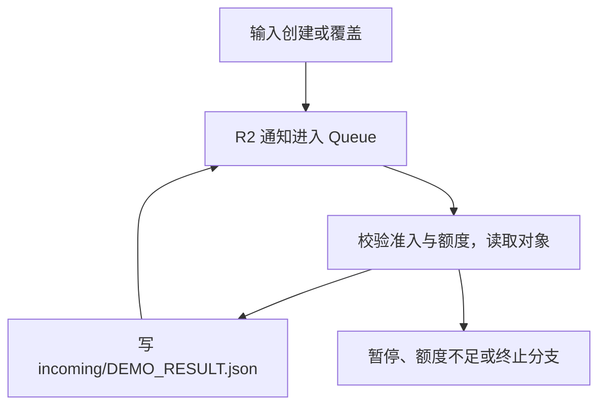

# Cloudflare 费用风险审计

## 1. 给非程序员的摘要

这份未部署的虚构项目存在可由源码确认的重复工作和控制设计缺口；本次没有观察到真实费用或线上事故。  
先让处理完成的文件退出处理链，并让失败报告确实在约定次数后结束，避免同一件工作反复执行。  
把“全项目每天 100 个工作单位”的扣减改成不可被并发重复领取的方式，并修正删除定时任务的操作说明。  
若以后接通 Agent，凭证应留在受控执行服务中，恢复必须由人决定，重复告警也不应反复启动模型分析。  
实际套餐、账单提醒、部署状态、信号时效和暂停效果均缺少真实证据；以下结论是源码与计划设计审计，不是费用上限保证。

## 2. 审计范围与证据

**范围与时间。** 审计对象仅为 `demo-runaway`；文中项目文件位置均相对于 `examples/demo-runaway/`。环境为 `FICTIONAL_SOURCE_REVIEW_ONLY`，审计日期为 **2026-10-07，Etc/UTC**；源码快照核对时间为 **10:52 UTC**。采用 `audit-cloudflare-costs` **0.2.0** 及本次定稿时的引用材料，包含 L4-07 对“总量上限与去重分别判断”的校准，以及缺口和严重程度分开评估的说明。未提供可核实的 Git 提交号或未提交改动状态；没有为寻找这些元数据扩大目录范围。15 个审阅文件按相对文件名排序，以“文件名、NUL、文件原始字节、NUL”串联计算的 SHA-256 为 `7a98e10ac91ce682c50548d95dcf417fb842b5eff7438eb85e4b332ade98aeb6`。

**来源与证据边界。** `README.md:3–11, 40–52` 明确说明这是不可部署的教学材料；`evidence/scenario.json:2–16, 25` 也声明无真实账户、套餐、部署版本或运行历史。包括模拟“历史配置”和通知订阅在内，全部项目材料均按**源码（SOURCE）**处理，注明虚构来源；没有可计作真实**部署配置（DEPLOYED_CONFIG）**、真实**提供的记录（SUPPLIED_RECORD）**、成功**测试记录（TEST_RECORD）**或**运行指标（LIVE_METRICS）**的材料。最新运行指标时间为“无可用记录”，不表示用量为零。本文的**通过（PASS）**仅在具体写明的源码范围内成立；任何真实部署、账户权限及端到端有效性仍须独立核实。

**预算与授权。** 本次已明确跳过月预算和临时停机偏好；金额、币种、账期、外部 API 是否纳入及可接受停机时间均未设定，不建议具体货币阈值。项目说明接受控制状态或额度不可确认时拒绝新工作，这是项目设计声明，不是本次执行暂停的授权（`ops/pause-runbook.md:3–5`）。`DAILY_WORK_UNITS = "100"` 是 UTC 日 R2 操作准入单位，不是货币预算，也不覆盖全部产品费用（`README.md:54–57`；`src/quota.js:1–13`）。

**独立性与执行边界。** 初稿在未读取预期答案、此前报告或目录外验证材料的情况下完成，审阅了下表中的全部 15 个文件及适用的官方资料。初稿已留存；随后依据相同源码和现有 L2-15 作了一次定向复核，新增 F-10，过程和差异单列在报告外的对照说明中。本报告为复核后终稿，未新增部署、测试或运行证据。本轮项目审计未修改示例、安装依赖、构建或运行项目、发业务请求或合成告警、调用接管 Agent、连接真实账户、暂停或恢复；建议均未实施。

| 项目证据 | 覆盖内容 | 来源说明 |
| --- | --- | --- |
| `README.md`；`evidence/scenario.json` | 范围、预期行为、初始未启用状态、固定资源、无执行记录 | 虚构说明，源码（SOURCE） |
| `wrangler.toml`；`evidence/last-applied-wrangler.synthetic.toml` | 当前声明的绑定、CPU、入口与队列限制；模拟旧 Cron | 后者不是部署导出，均为源码（SOURCE） |
| `config/r2-notifications.synthetic.json` | `incoming/`、`.json`、`object-create` 的假设订阅 | 模拟配置，源码（SOURCE） |
| `src/worker.js`；`src/control.js` | HTTP、Cron、Queue 调用链；两个固定 DO；暂停状态和查询 | 源码（SOURCE） |
| `src/quota.js`；`src/export-job.js`；`src/r2-consumer.js` | 工作额度、一次性报告生命周期、R2 事件消费 | 源码（SOURCE） |
| `web/index.html`；`web/status.js` | 直接静态资源、带认证的状态轮询及停止条件 | 源码（SOURCE） |
| `ops/pause-runbook.md` | 分步骤暂停、状态回读、剩余费用、人工恢复 | 未执行的操作说明，源码（SOURCE） |
| `planned-agent/plan.json`；`planned-agent/adapter.js` | 未来信号、模型、工具、凭证、计数和记录路径 | 明确为计划中且未连接，源码（SOURCE） |

已检查文件清单和导入、导出、绑定、环境声明、共享控制及设计说明。范围内未发现其他环境覆盖、依赖脚本、部署工作流、隐藏部署配置或现存测试记录。没有实际使用 D1、Workflows、WebSocket、AI Gateway 或已接通的 MCP 服务；对应产品子检查为**不适用（NOT_APPLICABLE）**，不据此要求增设这些产品。Agent 集成确实有计划，不能把第四层整层标为不适用（`README.md:20–22`；`planned-agent/plan.json:2–5, 23–27`）。

**官方核验，访问日期均为 2026-10-07。** 以下仅用于确认平台语义，不证明示例资源真实存在或相关设置已生效。

| 官方来源 | 本报告采用的事实及边界 |
| --- | --- |
| [Workers 计费](https://developers.cloudflare.com/workers/platform/pricing/)；[Workers 限制](https://developers.cloudflare.com/workers/platform/limits/) | Worker 请求、CPU 与套餐应分别核实；每次 CPU 限制不是数据库操作数、跨次重试或月费用上限。 |
| [Static Assets 计费](https://developers.cloudflare.com/workers/static-assets/billing-and-limitations/) | 直接服务静态资源与运行 Worker 的请求计费不同；`run_worker_first` 匹配路径会运行 Worker。 |
| [KV 计费](https://developers.cloudflare.com/kv/platform/pricing/)；[KV 一致性](https://developers.cloudflare.com/kv/concepts/how-kv-works/) | 免费计划相关日限额耗尽会使相应操作失败；普通 KV 读后写不提供原子预留，读取具有最终一致性。 |
| [R2 计费](https://developers.cloudflare.com/r2/pricing/)；[R2 事件通知](https://developers.cloudflare.com/r2/buckets/event-notifications/) | R2 存储、写类操作、读类操作分别计量；覆盖写也属于 `object-create`，前后缀共同决定匹配。 |
| [DO 计费](https://developers.cloudflare.com/durable-objects/platform/pricing/)；[DO 闹钟](https://developers.cloudflare.com/durable-objects/api/alarms/) | 按 DO 活跃生命周期和存储后端判断费用；未来闹钟不等于持续占用计费。单次闹钟失败重试与应用新设闹钟是不同边界。 |
| [Queues 计费](https://developers.cloudflare.com/queues/platform/pricing/)；[确认与重试](https://developers.cloudflare.com/queues/configuration/batching-retries/)；[暂停投递](https://developers.cloudflare.com/queues/configuration/pause-purge/) | 消息写入、读取、删除和重试涉及操作计量；显式确认及有限原生重试不限制新事件链；暂停投递仍允许入队并保留到期规则。 |
| [Cron 移除语义](https://developers.cloudflare.com/workers/configuration/cron-triggers/) | Wrangler 中省略 `triggers` 或 `crons` 会保留现有部署的 Cron；清空须显式声明空数组并有应用后的状态证据。 |
| [Budget alerts](https://developers.cloudflare.com/billing/manage/budget-alerts/)；[默认提醒说明](https://developers.cloudflare.com/changelog/post/2026-06-15-budget-alerts-default-on/) | 账期内账户合并用量提醒不是自动停费；提醒排除订阅固定费，前一日用量次日处理。不能推断本项目已有合适的提醒或收件记录。 |
| [费用硬上限公告](https://blog.cloudflare.com/enterprise-for-all-update/) | 当前公告描述原型和预计可用阶段；它不能证明某一账户是否获得、启用或受其完整覆盖。 |
| [Delete Worker API](https://developers.cloudflare.com/api/resources/workers/subresources/scripts/methods/delete/)；[Agent 安全设计指引](https://developers.openai.com/api/docs/guides/agent-builder-safety) | `Workers Scripts Write` 也能授权删除 Worker；不可信文本进入特权指令会影响工具选择。后者用于设计分析，不表示此示例使用 OpenAI 或任何指定厂商。 |
| [页面可见性与后台计时器](https://developer.mozilla.org/en-US/docs/Web/API/Page_Visibility_API) | 普通隐藏标签通过可见性状态识别；浏览器可能节流后台计时器，不能假设所有隐藏标签都严格每 3 秒请求。此文为 Mozilla 的浏览器 API 文档。 |

**结果。** 建立 **10 项源码或计划设计发现：高（High）4 项、中（Medium）3 项、低（Low）3 项；严重（Critical）0 项**。没有用缺少账户访问或缺少历史测试作为高严重程度理由。收费后果均以将来接线、有效认证、开启准入以及对应计划的可计费用量为前提；免费额度可能先表现为可用性损失。没有计算月账单或给出安全评分。

## 3. 四层覆盖

| 层 | 已观察到的控制 | 已证实缺口 | 待验证内容 | 证据等级 |
| --- | --- | --- | --- | --- |
| 第一层 账单提醒 | 声明区分 R2 工作单位和全部费用；运行说明保留固定费、存储及已接收操作的剩余费用 | 未建立账户侧提醒缺失的事实，不以无导出判失败 | 账户、套餐、可用/已启用硬上限、提醒策略与投递、账期和数据时效 | 源码（SOURCE）；账户侧均待验证（UNKNOWN） |
| 第二层 代码限制 | 认证先行；固定对象和输入键；4 KiB 输入检查；CPU 配置；每条队列消息显式处置；单条批次、单消费者并发、2 次原生重试；先检查额度再访问 R2；控制失败时不新增 R2 工作 | F-01 结果事件回流及重复计费窗口；F-02 KV 额度竞争；F-05 重试计数被清零；F-10 隐藏标签仍轮询 | 实际 CPU/套餐限制、运行中的量级及配额超额、外部模型和保护链自身的完整计费 | 源码（SOURCE）；有通过（PASS）、缺口（GAP）与待验证（UNKNOWN） |
| 第三层 自动暂停 | 持久化准入关闭；单例报告禁用并删未来闹钟；队列原生暂停和回读步骤；人工恢复说明；在途与存储费用明确保留 | F-06 Cron 操作说明无效；F-03 计划权限过大；F-04 Agent 可清除已经要求保留的停止状态 | 实际信号谓词、检测时效、执行器失效表现、队列/Cron 回读、停后工作量和恢复记录 | 源码（SOURCE）；没有实际暂停成功证据 |
| 第四层 Agent 接管 | 计划状态明确；项目/账户字段校验；固定目标与工具名称校验；确定规则先调用暂停再运行模型；日调用计数、输入/输出和超时限制；记录未知结果 | F-03 凭证入模型上下文；F-04 可恢复；F-07 不可信告警进入 system 指令；F-08 重复信号重复分析；F-09 处置模板缺少判断依据 | 未来宿主、实际模型/SDK、完整工具权限、信号来源与重放控制、运行链和历史端到端记录 | 源码（SOURCE），集成为计划中且未连接 |

统计见第 7 节。某一子控制通过，不代表整层通过；例如规则动作确实先于模型调用，但后续模型仍可恢复准入。

## 4. 付费路径清单

本节的“付费操作”指平台的计量维度，并不表示虚构项目已发生收费。各路径均以真实绑定及调用能力将来存在为前提；应用初始 `active` 未提供，读取不为 `true` 时默认拒绝工作（`evidence/scenario.json:16`；`src/control.js:18–23, 31–38`）。

| 路径/资源 | 触发/环境 | 付费操作 / 套餐边界 | 限制 | 证据 |
| --- | --- | --- | --- | --- |
| 静态页面和脚本 | 匹配 `web/index.html`、`web/status.js` 的静态访问 | 直接 Static Assets 服务与 Worker 计量分开；不能把 API 视作静态免费请求 | `run_worker_first` 只匹配 `/api/*`、`/ops/*`；未发现 SSR 或构建付费钩子 | `wrangler.toml:12–15`；`src/worker.js:18–22`；[静态资源计费](https://developers.cloudflare.com/workers/static-assets/billing-and-limitations/) |
| 报告提交与报告 DO | 认证 `POST /api/start` → 固定 `ReportJob` → `alarm()` | Worker、DO 请求/活跃时长/SQLite 存储；每次获准尝试最多一次 R2 读取和一次结果写入；相应 KV 额度操作 | 一个固定 DO；运行中重复 start 不重建任务；输入键固定、4 KiB；持久化关闭与付费前检查；每次预留 2 单位；重试计数缺口见 F-05 | `src/worker.js:21–29`；`src/control.js:7–9`；`src/export-job.js:4–8, 30–82` |
| Cron 生产者 | 场景中的旧 `*/5 * * * *` → `scheduled()` | Worker、控制 DO 读取、KV 额度读写、一次 R2 写入及其通知 | 每次只写一个小的固定输入；预留 1 单位；写前再查准入。当前源码只注释 Cron，不证明云端有或无定时任务 | `src/worker.js:43–47`；`wrangler.toml:50–52`；`evidence/last-applied-wrangler.synthetic.toml:1–8` |
| R2 通知 → Queue → 消费者 → R2 | 匹配 `incoming/` 和 `.json` 的创建/覆盖事件 | 每个消费轮次最多一读一写；Queue 操作、Worker、KV 和控制 DO 调用；结果会再次匹配同一订阅 | 两个输入键、4 KiB、结果摘要 64 字符；批次 1、并发 1、原生重试 2、DLQ；每次预留 2 单位；无成功事件链终态或版本处理凭据 | `config/r2-notifications.synthetic.json:5–12`；`src/r2-consumer.js:4–44`；`wrangler.toml:43–48` |
| 工作额度存储 `QUOTA` | Cron、报告和 Queue 共用 `reserveWorkUnits()` | 每次校验读取一个 KV 键，获准时写一次；这些操作自身不从 R2 工作单位中扣除 | UTC 日键、48 小时 TTL、整数/范围校验；无原子总量预留 | `src/quota.js:1–14`；三个调用点见前述行号 |
| 状态轮询 | 用户提交查看表单 → 每 3 秒 `GET /api/status` → 报告 DO | 每次成功轮询含 Worker、一个报告 DO 调用及 `job`、`enabled` 两次存储读取；不访问 R2、不扣 R2 单位 | 防重叠、2.5 秒请求超时、连续错误 3 次停止、终态停止、手动和 `pagehide` 停止；没有页面隐藏检查或总观看时长限制 | `web/status.js:13–46`；`src/worker.js:24–25`；`src/export-job.js:18–21` |
| 控制查询、暂停和人工恢复接口 | 单独 OPS 认证的 `/ops/*` → 控制/报告 DO | Worker、DO 及其存储操作；无需 R2 操作；状态回读仍消耗自身计量 | 固定的两个 DO；Bearer 与业务认证分离；暂停先持久化再禁用报告；只声明应用状态，其他项保留未知 | `src/worker.js:21–35`；`src/control.js:26–59` |
| 数据与待处理消息留存 | R2、两个 SQLite DO、KV 日计数、Queue/DLQ | R2/DO/KV 留存按各自产品和套餐核算；Queue 按写入、读取、删除及重试操作计量，不能据等待时间推导存储时长费用；暂停不等于取消固定费或删除数据 | 应用只使用四个 R2 键、两个固定 DO；KV 键有 TTL；输出长度固定；没有不受控的对象名称生成或上传路径 | `evidence/scenario.json:17–24`；`src/control.js:3–9, 58`；`src/quota.js:8–13`；[R2](https://developers.cloudflare.com/r2/pricing/)、[DO](https://developers.cloudflare.com/durable-objects/platform/pricing/)、[Queues](https://developers.cloudflare.com/queues/platform/pricing/) |
| 计划 Agent 响应链 | 未来宿主已认证、范围正确的 `signal` → `handleDeliveredSignal()` | 计划中的模型调用、应用控制工具、事务计数和最后 20 条记录；没有已接通的外部提供商 | 按假设的同一事务状态存储，每 UTC 日最多 20 次模型调用；告警截取 1,200 字符、输出 256 tokens、超时 5 秒、模型重试 0；每次只执行一个模型选择工具，再读取状态。规则触发时另有一次前置暂停，不计入模型调用配额 | `planned-agent/plan.json:17–27`；`planned-agent/adapter.js:4–35, 39–101` |

状态轮询在持续 `running` 时约为每个观看会话每分钟 20 个定时请求，另有首次即时查询；这是由 3 秒间隔推导的正常前台请求速率，未乘以虚构用户数或运行时长。后台浏览器可能节流或挂起计时器，不能把这个速率直接用于所有隐藏标签。已有终态和错误停止有效，但没有覆盖普通隐藏标签，F-10 将其作为低严重程度的可避免读取。源码中的两次 `storage.get()` 是 API 调用次数，不等于两次实际收费读取；实际 SQLite 行读取、已包含额度和套餐计量仍待验证。R2 工作单位上限不覆盖此状态路径。

R2 成功事件的关键关系如下。每一轮均会重新查准入和额度，遇到关闭、额度不足、无输入或错误会走相应拒绝/有限重试分支；这些分支没有修复“结果也是合法输入”的关系。

### 暂停动作对照

| 产生费用的路径/状态 | 已有动作与范围 | 仍可能发生的工作 / 所需验证 |
| --- | --- | --- |
| 新报告和内部 R2 调用 | `active=false` 拒绝 start，报告、Cron、Queue 均检查共享状态 | 状态和控制请求仍运行；最后一次检查前已获准的操作可能结束。入口的真实 hostname、Access 和部署范围待验证 |
| 报告 DO | `enabled=false` 与 `deleteAlarm()`；构造函数不重启任务；重排闹钟前检查状态 | 未来闹钟取消不证明当前执行取消；运行中的 R2 写入和后续少量存储写入需观测 |
| Queue/DLQ | 操作说明要求原生 `pause-delivery`；生产者同时受准入开关保护；已交付消息显式 retry | 应用 `/ops/pause` 不调用原生 Queue 暂停。剩余交付、重试、在途通知及保存期限需单独回读；有限重试耗尽可进入 DLQ |
| Cron | 操作说明要求交付注释后的配置 | F-06：按官方语义不会清除已有 Cron；准入关闭仍可拦 R2 写入，但 Cron Worker/控制读取可能继续 |
| 计划 Agent 模型调用 | 明确规则先调用应用暂停；后续分析有日计数 | Agent 选择恢复会重新开准入（F-04）；重复告警会重复分析（F-08）；没有外部异步业务任务取消接口 |
| 已存储资源和固定收费 | 保留资源，不以删除替代暂停 | R2/DO/KV 留存、Queue 生命周期及适用订阅费继续单独核算 |

依据：`src/control.js:18–59`；`src/export-job.js:23–27, 44–74`；`src/r2-consumer.js:18–43`；`ops/pause-runbook.md:16–57`。平台边界见 [DO 闹钟](https://developers.cloudflare.com/durable-objects/api/alarms/)、[Queue 暂停](https://developers.cloudflare.com/queues/configuration/pause-purge/)及 [Cron](https://developers.cloudflare.com/workers/configuration/cron-triggers/)。源码同时声明 `workers_dev=false` 和 `preview_urls=false`，没有已建立的替代 URL 绕过证据；真实路由、其他版本/预览及 Access 覆盖仍在第 6 节列为待验证。

## 5. 优先发现

下列发现均为已建立的源码或设计问题；严重程度描述相应前提成立后的影响。验收证据是未来的有限验证建议，不是本次执行或成功通过的记录。

### F-01

| 字段 | 内容 |
| --- | --- |
| 编号 | F-01 |
| 标题 | R2 处理结果仍是合法输入，成功事件可以反复产生下一轮收费操作 |
| 严重程度 | 高（High）：一次合法输入可持续放大到新的消费轮次，缺少根任务的完成边界；实际金额取决于未来套餐及已有额度。 |
| 所属层 | 第二层 代码限制；关联第三层 自动暂停 |
| 规则编号 | L2-08、L2-09、L2-12 |
| 判定 | 缺口（GAP） |
| 证据等级 | 源码（SOURCE），包含明确标注的虚构通知订阅；不是线上事件记录。 |
| 证据位置 | `config/r2-notifications.synthetic.json:5–12`；`src/r2-consumer.js:4–7, 12–15, 23–41`；`src/worker.js:43–47, 50–51`；`wrangler.toml:43–48`。官方：[R2 事件通知](https://developers.cloudflare.com/r2/buckets/event-notifications/)及 [Queue 确认与重试](https://developers.cloudflare.com/queues/configuration/batching-retries/)。 |
| 执行链 | 假设准入被授权开启、通知按场景接通且对象存在：一次 `incoming/DEMO_INPUT.json` 写入 → 通知 → 读取输入 → 写 `incoming/DEMO_RESULT.json` → 该覆盖写再次匹配 `incoming/`、`.json`、`object-create` → 消费者又接受结果键。每轮最多增加一次 R2 读、一次 R2 写及关联 Queue/Worker/KV/DO 工作。`eTag` 仅用于输出内容，没有原子处理凭据；写入成功但确认前失败，也存在重复读写窗口。 |
| 现有控制 | 固定键、4 KiB 输入和 64 字符摘要限制单轮与留存大小；单批 1 条、并发 1、原生重试 2、共享准入及每次 2 单位额度会限制或停止工作。它们没有排除结果事件；新成功事件不是原消息的第 3 次重试。额度拒绝会进入有限重试/DLQ，不能断言单链必然永远运行；F-02 又使名义日额度不能作为严格总量。未建立存储对象无限增长或真实高额账单事实。 |
| 最小修复 | 将结果写入不匹配订阅的前缀/桶，并在消费者仅允许原始输入键；保留原始业务版本身份和有限处理预算，对重复版本使用可核实的处理状态。代价是明确区分输入与输出，并维护少量状态；无需引入额外付费产品。 |
| 验收证据 | 待取得离线、断网替身记录：一个合法输入至多产生一个结果；把该结果事件再次交给过滤逻辑不得新增 R2 操作。再用同一业务版本重复交付，以及写成但确认未完成的有限场景，证明重复处理被识别或明确挂起；测试最多跟踪 5 个事件步，真实业务/付费调用为 0。以后如需部署验证，只读取该订阅的实际过滤器与已有有界计数。 |

### F-02

| 字段 | 内容 |
| --- | --- |
| 编号 | F-02 |
| 标题 | 项目日额度先读后写，两个调用方可重复领取最后一份额度 |
| 严重程度 | 高（High）：目标为全项目的硬准入额度缺少可执行的原子保证，影响多个实际调用链；不据此推算无穷用量。 |
| 所属层 | 第二层 代码限制 |
| 规则编号 | L2-05、L2-07 |
| 判定 | 缺口（GAP） |
| 证据等级 | 源码（SOURCE），限本项目声明的 100 个 UTC 日 R2 准入单位。 |
| 证据位置 | `src/quota.js:1–14`；`src/worker.js:43–47`；`src/export-job.js:59–65`；`src/r2-consumer.js:23–27`；`wrangler.toml:20, 43–48`。官方：[KV 一致性](https://developers.cloudflare.com/kv/concepts/how-kv-works/)。 |
| 执行链 | 报告与 Queue 等独立调用方可同时读取同一日键，再分别写回增加后的值。例如已有 98 单位，两个各需 2 单位的调用都读到 98，各写 100 并获准，总共释放 4 单位，但账面仅增加 2。普通 KV 的最终一致性又不提供跨位置的实时统一余额。 |
| 现有控制 | 额度在 R2 操作前检查；非法数值/超额不放行；KV 读取或写入出错也不会继续进入本次 R2 操作；日窗口与 48 小时 TTL 明确。Queue 并发 1 只约束其消费者，不串行化独立 Cron 和报告 DO。该额度被正确描述为 R2 工作单位，缺口不是“它没有宣称覆盖所有账单”。 |
| 最小修复 | 将读取、比较、扣减和预留关联移入同一强一致事务权威，可复用现有控制 DO；所有调用方在下一次 R2 工作前向同一权威预留。保留失败时拒绝准入的策略。代价是增加集中状态的职责与协调延迟；不擅自改变 100 单位或设置货币预算。 |
| 验收证据 | 待审阅原子实现及有限竞争记录：剩余 2 单位时，两个并发的 2 单位预留恰有一个成功，另一个在 R2 前拒绝；还应覆盖余额读取失败、跨 UTC 日和重试不退还已承诺用量。可先使用无出网、无真实 R2 的隔离状态模型，真实付费调用为 0；部署后仍需绑定和权威实例映射证据。 |

### F-03

| 字段 | 内容 |
| --- | --- |
| 编号 | F-03 |
| 标题 | 计划把跨账户写权限凭证直接放入模型指令，突破受控执行服务的凭证边界 |
| 严重程度 | 高（High）：若未来换成有效凭证，影响面超出查询与指定暂停；当前没有真实凭证泄露的证据。 |
| 所属层 | 第四层 Agent 接管；关联第三层 自动暂停 |
| 规则编号 | L4-03、L4-09、L3-11 |
| 判定 | 缺口（GAP） |
| 证据等级 | 源码（SOURCE），仅计划设计；权限列表为意图声明，未核实实际 Token 权限。 |
| 证据位置 | `planned-agent/plan.json:10–16` 的凭证引用及预期权限，凭证值不在报告中复述；`planned-agent/adapter.js:72–85` 把 `plan.cloudflare_token.value` 拼入模型 `system`。官方：[Delete Worker API](https://developers.cloudflare.com/api/resources/workers/subresources/scripts/methods/delete/)及 [Agent 安全设计](https://developers.openai.com/api/docs/guides/agent-builder-safety)。 |
| 执行链 | 未来有效信号通过校验和调用额度 → 构造含直接 Cloudflare 凭证的系统指令 → `agent.run()` 交给模型提供方。计划权限作用于所有可访问账户，并包含 `Workers Scripts Write`；官方删除 Worker 接口也接受该权限。因此这不是仅暂停的凭证设计，模型上下文或第三方服务将接触不必要的直接账号授权材料。 |
| 现有控制 | 当前所有值均为不可用占位符；应用 OPS 凭证在 transport 的认证头中使用，工具路径固定；记录不保存原始提示词。这些控制不阻止直接 Cloudflare 凭证在请求模型前进入上下文。没有证据表明真实模型已收到密钥，也未证实当前工具能发任意 Cloudflare 请求。 |
| 最小修复 | 从模型输入和第三方配置删除直接 Cloudflare 凭证；将其仅留在受控执行服务，向 Agent 暴露目标固定、服务端鉴权的查询及暂停能力；实际权限按指定资源收缩。代价是执行服务承担凭证隔离和权限维护。现阶段无真实凭证，不提出无依据的轮换操作。 |
| 验收证据 | 待提供脱敏的凭证加载路径、真实权限元数据和模型请求字段表；用无效哨兵值检查序列化输入、工具结果及错误路径，确认直接上游凭证不会离开执行服务。检验替身服务拒绝跨项目及非允许动作，真实模型/Cloudflare 调用为 0。 |

### F-04

| 字段 | 内容 |
| --- | --- |
| 编号 | F-04 |
| 标题 | Agent 可调用恢复接口，甚至在确定规则刚暂停后重新开启准入 |
| 严重程度 | 高（High）：确定停止条件可以被后续模型选择撤销，重新允许存在 F-01/F-05 缺口的工作链。 |
| 所属层 | 第四层 Agent 接管；关联第三层 自动暂停 |
| 规则编号 | L4-02、L4-05、L4-06、L3-10、L3-13 |
| 判定 | 缺口（GAP） |
| 证据等级 | 源码（SOURCE），为计划适配器与应用控制接口之间可追踪的设计链。 |
| 证据位置 | `planned-agent/plan.json:21`；`planned-agent/adapter.js:4–18, 55–65, 79–94`；`src/worker.js:33–35`；`src/control.js:36–38`；`ops/pause-runbook.md:45–56`。 |
| 执行链 | `ruleTripped=true` → 固定调用 `pause_project` → 模型选中合法工具 `resume_project` → `/ops/resume` → `active=true`。整个路径没有人工批准检查，也没有禁止在停止规则仍成立时恢复的服务端条件。具备实际接线、有效 OPS 身份且模型作此选择时，新的报告提交和原本仍可到达的生产/消费路径可重新获准。 |
| 现有控制 | 固定规则确实在模型预算检查和模型运行之前执行；即使模型不可用，首次暂停不依赖其回答。动作目标固定、工具名有白名单，每次模型只选一个工具。恢复只打开应用准入，不会自动重启旧报告、恢复 Cron 或原生队列投递。上述范围限制不能保证已关闭的准入保持关闭；人工恢复说明未转化为 Agent 权限边界。 |
| 最小修复 | 从 Agent 可达工具和等价通路移除恢复权限；停止状态保持锁定，人工恢复走独立的授权入口，并检查预算、根因、积压和不确定结果。代价是恢复需要人决定；保留模型提出建议的能力即可。该人工恢复要求是本审计的工程规则及项目现有说明，不是对平台默认行为的声称。 |
| 验收证据 | 待取得完整工具/身份权限清单和无出网的有限拒绝记录：规则成立时，即使模型返回 `resume_project`，应用准入仍为关闭；模型超时、错误和未知工具均不能清除停止状态。人工恢复需要独立身份及项目/停止事件关联。至少覆盖 4 种模型结果，真实暂停/恢复调用为 0。 |

### F-05

| 字段 | 内容 |
| --- | --- |
| 编号 | F-05 |
| 标题 | 报告失败重排闹钟时把重试次数归零，约定的最多三次尝试无法成立 |
| 严重程度 | 中（Medium）：次数限制失效会造成额外 R2 读取和调度工作；固定对象、30 秒间隔、准入开关和日额度仍形成重要限制。 |
| 所属层 | 第二层 代码限制 |
| 规则编号 | L2-08、L2-10 |
| 判定 | 缺口（GAP） |
| 证据等级 | 源码（SOURCE）；没有报告任务实际执行记录。 |
| 证据位置 | `evidence/scenario.json:14, 23`；`src/export-job.js:4–8, 48–54, 57–82`。官方：[DO 闹钟](https://developers.cloudflare.com/durable-objects/api/alarms/)。 |
| 执行链 | 已授权开启并 start 后，输入缺失等错误 → `next.retries = job.retries + 1` → 小于 3 时 `scheduleNext(next)` → 保存 `{...job, retries: 0}` → 30 秒后读到 0 → 再次增加到 1。因此该分支不能累计到 3。每个获准尝试预留 2 单位并读取 R2；主动新设闹钟不是对同一闹钟事件的原生失败重试。 |
| 现有控制 | 一个固定报告 DO、运行中重复 start 的抑制、4 KiB 输入、固定结果键、成功完成和超大输入失败的终态都存在；额度拒绝会写入 `quota-held` 并停止重排；暂停持久化且构造函数不启用闹钟。因此不能将一次报告描述为无条件永久运行或持续占用全部闹钟间隔的计费时长。 |
| 最小修复 | 重排时保留已经增加的持久化次数，并明确“三次”表示总尝试还是额外重试；到达约定上限后写入终态，不再设未来闹钟。代价是长期输入不可用时更早终止，需要明确的人为重启而不是无限补尝试。 |
| 验收证据 | 待取得离线有限状态记录：连续三次缺输入时累计次数为 1、2、3，进入 `failed`，第四次调度不发起 R2 操作；暂停与重排交错后 `enabled=false` 且无未来闹钟。检查最多 4 个调度步，不启动 DO 或真实存储，实际付费调用为 0。 |

### F-06

| 字段 | 内容 |
| --- | --- |
| 编号 | F-06 |
| 标题 | 暂停说明用注释 Cron 配置代替清空，无法移除先前已配置的定时任务 |
| 严重程度 | 中（Medium）：停止流程的目标不能由该步骤实现，但持久化准入开关仍保护 R2 写入；主要剩余暴露是调度与控制调用。 |
| 所属层 | 第三层 自动暂停 |
| 规则编号 | L3-06、L3-07 |
| 判定 | 缺口（GAP） |
| 证据等级 | 源码（SOURCE），含虚构旧 Cron 片段；不是实际部署漂移或运行记录。 |
| 证据位置 | `ops/pause-runbook.md:25–31`；`wrangler.toml:50–52`；`evidence/last-applied-wrangler.synthetic.toml:1–8`；`src/worker.js:43–47`。官方：[移除 Cron Trigger](https://developers.cloudflare.com/workers/configuration/cron-triggers/)。 |
| 执行链 | 假设先前确实应用过场景中的每 5 分钟 Cron → 按当前说明把 `[triggers]` 和 `crons` 注释 → 经授权发布该配置。官方说明 `triggers`/`crons` 未定义会保留现有 Cron，故不能由这一步得到期望的空列表。若旧任务存在，它仍可能触发 Worker 和控制 DO 读取。 |
| 现有控制 | 暂停先写 `active=false`，`scheduled()` 在预留和写 R2 前检查状态；说明还要求真实列表回读，并在读回失败时保持暂停。因此不能声称暂停后 R2 必然继续写入，也不能把模拟旧配置称为已经部署的定时任务。 |
| 最小修复 | 在有关环境明确声明 `[triggers]` 下 `crons = []`，把“应用配置后取得空列表”作为成功条件，并在传播和在途执行期间保持准入关闭。代价是后续人工恢复需要明确恢复期望的日程；本次仅建议修改。 |
| 验收证据 | 待审阅修正后的配置和步骤，确认未用省略代替空数组。若以后有正式授权和真实环境，再读取授权发布后的该 Worker 日程列表与已有调用时间线；不能把源文件为空当成云端已清除。本次不部署、不删 Cron、不触发调度。 |

### F-07

| 字段 | 内容 |
| --- | --- |
| 编号 | F-07 |
| 标题 | 外部告警原文被提升为 system 指令内容，能影响有权限的工具选择 |
| 严重程度 | 中（Medium）：不可信文本跨越指令边界；现有固定目标和有限工具集合约束影响范围，是否诱导成功没有运行证据。 |
| 所属层 | 第四层 Agent 接管 |
| 规则编号 | L4-04 |
| 判定 | 缺口（GAP） |
| 证据等级 | 源码（SOURCE），计划信号明确保留外部提供的 `alertText`。 |
| 证据位置 | `planned-agent/plan.json:23`；`planned-agent/adapter.js:39–43, 72–94`。官方设计依据：[Agent 安全指引中对不可信输入与特权消息的说明](https://developers.openai.com/api/docs/guides/agent-builder-safety)。 |
| 执行链 | 合法宿主递交账户/项目匹配的信号，其中告警文本仍来自外部 → `slice(0, 1200)` → 与可信操作要求拼为同一 `systemInstruction` → 模型选择工具 → 名称属于白名单即被执行。可形成“告警文本要求恢复 → 合法但不合适的 `resume_project` 被执行”的设计路径，具体恢复权限后果已在 F-04 合并评估。 |
| 现有控制 | 校验账户、项目、布尔值和字符串类型；工具、HTTP 方法和目的源固定，模型不能传任意 URL、资源 ID 或工具名；输入长度和输出长度有界。问题不在缺少所有范围检查，而在数据被当作特权指令，且对允许工具的选择缺少与停止政策一致的服务端约束。没有证据表明任意账户可被直接选作本工具目标。 |
| 最小修复 | 将告警作为明确标记的不可信数据输入，与固定指令分离，只提取必要的结构化字段；同时由服务端按身份、项目和停止状态决定允许动作，结合 F-04 移除恢复能力。代价是保留自由文本解释时需维护结构化摘要；仅增加“忽略恶意文字”提示或截短输入不能建立授权边界。 |
| 验收证据 | 待审阅最终序列化结构及服务端政策：不可信文本不得拼入特权指令。以离线固定模型输出替身检查恶意“恢复”、跨项目、未知工具和外发目标 4 类输入，即使模型给出越界选择也被拒绝；实际模型、Webhook 和控制接口调用为 0。 |

### F-08

| 字段 | 内容 |
| --- | --- |
| 编号 | F-08 |
| 标题 | 重复信号会重复启动 Agent 分析，日总量上限没有承担去重作用 |
| 严重程度 | 低（Low）：已证明的是有限调用配额中的可避免重复工作，可能提前消耗当日分析机会；没有证据支持“无限模型费用”。 |
| 所属层 | 第四层 Agent 接管；关联第二层 代码限制 |
| 规则编号 | L4-07 |
| 判定 | 缺口（GAP） |
| 证据等级 | 源码（SOURCE），假设未来同一宿主状态存储和传输契约成立。 |
| 证据位置 | `planned-agent/adapter.js:21–35, 39–44, 55–85, 90–100`；`planned-agent/plan.json:17–27`。 |
| 执行链 | 同一个合法信号再次传入 → 未查找事件/事件组处理记录 → 若 `ruleTripped=true`，再调用一次固定暂停 → 每次重新增加日模型计数 → 上限未满时再次 `agent.run()`。两个相同信号即可使模型计数从 0 到 2，且产生两次分析；`decisions` 历史只写不用于去重。模型预算用尽后，前置暂停和记录仍可重复；未来宿主的总体投递限制尚不明。 |
| 现有控制 | 事务计数将同一状态权威下的模型调用限制为每 UTC 日 20 次；每次告警原文至多 1,200 字符、输出 256 tokens、超时 5 秒、模型重试 0、模型选择工具 1 次；保留最近 20 条简短记录。应保留这些总量限制，但总量限制不等于同一事件只分析一次，也未证明事件速率或宿主并发限制。 |
| 最小修复 | 在可信信号契约加入稳定事件/事件组身份，按项目持久化去重及处理结果；重复投递返回已有处置或明确的结果未知状态，避免再次分析。对确定规则动作保留安全的重复处理语义，不因一次未知结果就永久跳过必要停止。代价是维护短期去重记录与合理有效期。 |
| 验收证据 | 待取得离线记录：相同事件连续/并发递交 3 次只启动一次模型分析，允许按既定政策进行有界的停止状态确认；两个不同事件按各自身份处理；新的独立事件仍受原来的日上限。使用计数替身及禁用出网的 transport，真实模型和暂停调用为 0。宿主的投递率及并发策略另需只读设计/配置证据。 |

### F-09

| 字段 | 内容 |
| --- | --- |
| 编号 | F-09 |
| 标题 | 计划处置记录缺少统计窗口和绝对用量，无法据此复核停止判断 |
| 严重程度 | 低（Low）：影响判断依据和后续人工复核；现有记录如实保留未知，没有“全部停费”的虚假结论。 |
| 所属层 | 第四层 Agent 接管；关联第三层 自动暂停 |
| 规则编号 | L4-08 |
| 判定 | 缺口（GAP） |
| 证据等级 | 源码（SOURCE），仅适配器实现的记录模板；运行报告与完整端到端证据仍待验证。 |
| 证据位置 | `planned-agent/adapter.js:32–35, 39–53, 59–63, 90–100`；`planned-agent/plan.json:27`；`src/control.js:51–59`。 |
| 执行链 | 接收 `ruleTripped` 和告警文本 → 执行固定动作/模型动作 → 保存时间、项目、动作及少量状态。模板没有结构化保存统计窗口、数据最新时间、绝对操作量及单位、比较基线或各动作时间，无法从记录判断是否使用了新鲜且足量的数据，也难以区分同一统计窗口内多次处置。 |
| 现有控制 | 有项目字段、动作名称、明确的失败/未知状态和应用状态回读；`chargingStopped` 明确标为需运行与控制平面证据；历史仅保存 20 条，不保存原始提示或客户数据。缺口是模板的解释依据不完整，而不是没有历史记录就证明暂停失败。 |
| 最小修复 | 从可信宿主接收并记录有限的统计窗口、数据时间、绝对量与单位、基线、规则/事件身份、动作时间和剩余任务状态；未提供的字段写待验证，不能补零或编造金额。代价是略增结构化记录大小；保持必要字段和保留上限。 |
| 验收证据 | 待提供一个明确标为离线的有限样例记录，能关联其输入统计、政策版本、动作与权威回读；过期数据和缺数据分别显示未知，应用回应不能写成所有收费停止。样例仅用固定替身数据，不向真实 Agent 发信号；历史端到端事实另列第 6 节。 |

### F-10

| 字段 | 内容 |
| --- | --- |
| 编号 | F-10 |
| 标题 | 普通隐藏标签仍保留状态轮询，产生没有当前显示用途的后台读取 |
| 严重程度 | 低（Low）：已证明的是可避免的重复请求；既有终态、错误和手动停止仍限制观看过程，没有证据支持无限费用或真实损失。 |
| 所属层 | 第二层 代码限制 |
| 规则编号 | L2-15 |
| 判定 | 缺口（GAP） |
| 证据等级 | 源码（SOURCE）；无真实浏览器请求或计费记录。 |
| 证据位置 | `web/status.js:13–33, 36–46`；`src/worker.js:21–25`；`src/export-job.js:18–21`；`wrangler.toml:12–15`。平台行为参见 [MDN 页面可见性](https://developer.mozilla.org/en-US/docs/Web/API/Page_Visibility_API)与 [Workers 计费](https://developers.cloudflare.com/workers/platform/pricing/)。 |
| 执行链 | 用户已用有效身份开始查看，报告持续为 `running` → 安装 3,000 ms 轮询 → 用户切到别的标签 → 代码未检查 `document.hidden` 或处理 `visibilitychange` → 若浏览器继续执行计时器，仍请求 `GET /api/status` → Worker 鉴权 → 固定报告 DO 的 `/status` → 两次 `storage.get()` 调用。单纯切换标签不等于触发 `pagehide`。这些是请求和 API 调用次数，不是已证实的计费读取数量；隐藏期间的准确速率还受浏览器节流影响。 |
| 现有控制 | 防重叠、2.5 秒超时、3 次连续错误停止、完成/失败/额度不足/暂停/空闲状态停止、手动停止、`pagehide` 停止均存在。它们覆盖错误、终态和离开页面，但不覆盖同一页面仍处于后台且报告继续运行的情况；该路径不访问 R2，也不受 R2 工作单位额度直接计数。 |
| 最小修复 | 在 `pollStatus()` 发请求前增加页面隐藏检查，或用可见性事件暂停和恢复正常轮询；保留全部现有停止条件，已经终止的查看会话不能因页面重新可见而复活。代价是后台状态显示停止刷新，返回前台后再更新。无需新增监控、数据库或长连接服务。 |
| 验收证据 | 待取得禁用出网的假 DOM、假计时器和 mock fetch 记录：有效会话隐藏后推进 3 个计时刻不新增请求，重新可见后恢复原轮询；终态、错误、手动停止和 `pagehide` 后，即使重新可见也不恢复请求；防重叠和超时仍有效。隐藏前已开始的请求可完成，不能把它误计为隐藏后新增请求。实际业务、Cloudflare 和模型调用为 0。 |

## 6. 待验证项

这些项目不因缺少访问或记录而被赋予严重程度。未来如果进入真实环境，最小证据应限定为所选项目、指定时间窗的只读配置或已有记录；不需要提供完整密钥、客户内容或全部日志。

| 规则/问题 | 未知原因 | 所需最小只读证据 | 尚不能支持的结论 |
| --- | --- | --- | --- |
| L1-01、L1-02；真实项目、账户、套餐与部署入口 | 唯一映射为虚构 ID，未部署；没有真实版本或账户订阅 | 若以后部署：指定 Worker 的版本/绑定、资源账户映射、套餐和生效的路由；同时核对 `workers_dev`、`preview_urls`、预览/别名及 Access 目标 | 已开付费套餐、某个公共 URL 可绕过限制、所有环境均已关闭 |
| L1-03；当前可用及启用的费用上限 | 公告及公开页面不能证明特定账户权益、启用状态或覆盖范围 | 该账户的权益/上限状态、期间、包含与排除产品、执行延迟、剩余收费说明 | Cloudflare 永远没有硬上限；本项目已经受账户总额硬上限保护 |
| L1-04、L1-05；预算策略及消息送达 | 没有实际策略或发送、收取记录 | 一份脱敏的策略字段及一条既有投递/处理记录，含账户、有效期和角色收件人 | “没有提醒”或“默认提醒一定能提醒正确的人” |
| L1-06、L3-01、L3-02；信号时效和停止规则 | 计划只接受宿主提供的 `ruleTripped`，未定义实际统计源、窗口或谓词 | 一个既有或正式设计的结构化规则，含绝对量、单位、项目范围、数据时刻、延迟、缺失/过期处理；说明实际触发通道 | 这是实时运营告警或预算邮件；每个额度异常都必然及时触发暂停 |
| L1-07、L3-03；费用范围和停止余量 | 用户跳过预算；无实际速率、包含额度、存储类别、传播延迟或已接收工作数量 | 后续自愿给出的费用范围与账期，加所选资源已有有界用量和在途任务摘要 | “100 R2 单位”等于全账单预算；确切月费用、可接受损失或停费时间 |
| L1-08、L2-18、L3-04；保护链和日志成本/失效 | 没有真实日志设置、宿主事件率、监控依赖与故障历史 | 所选服务的观测采样/留存配置，宿主投递和并发约束、失败处理及有限时间窗摘要 | 控制读取免费；模型 20 次上限也限制所有暂停工具和记录写入；执行器在应用过载时仍一定可用 |
| L2-03、L2-14；有效 CPU 限制和 DO 运行计量 | `cpu_ms=50` 与 SQLite 类只证明源码声明；无套餐兼容性/部署或生命周期数据 | 实际生效的 CPU 配置和使用计划；两个所选 DO 的后端及已有活跃时长概要 | 50 ms 在本环境实际执行；设有 30 秒未来闹钟就持续计费 30 秒 |
| L2-17、L4-01、L4-02、L4-03；未来宿主、模型及全部能力 | `.example.invalid` 地址、provider-neutral 接口、虚构权限；无 SDK 和可用 Token | 已选提供商/SDK 的版本及调用契约；宿主认证/绑定状态；完整工具入口和脱敏权限元数据 | 某厂商支持该唤醒机制；所有外部工具已收窄；真实模型价格或硬限额已知 |
| L3-05–L3-12；暂停实施和剩余工作 | 操作说明与应用代码存在，无实际动作或权威回读 | 若以后发生经授权的真实停止：动作标识/时间、控制 DO 状态、未来闹钟、Queue 暂停状态、Cron 列表、随后有限窗口的新工作计数 | 应用成功响应等于原生 Queue 已停、Cron 已移除、在途工作已清空或所有费用停止 |
| L3-13、L3-14、L4-06、L4-10；人工恢复和端到端历史 | 无执行记录，计划宿主未连接；已有模板也不能替代运行证据 | 以后已有的有限隔离测试/恢复记录，关联信号 ID、主体、版本、准确目标、动作和回读；标明环境、时间和费用边界 | 实际端到端已成功；因没有历史测试就判定该未上线集成运行失败 |

## 7. 规则判定

**计数口径。** 下表对 **51 条稳定规则各给一个主判定**；采用当前证据能够支持的范围，不把“源码通过”升级为上线保护。行内同时保留有意义的部分控制及部署未知事项。产品子检查不适用已在第 2 节说明，但本示例每条完整规则均仍有适用部分，因此整条规则的**不适用（NOT_APPLICABLE）为 0**。没有遗漏规则或把未核实项计作通过。

| 层 | 通过（PASS） | 缺口（GAP） | 待验证（UNKNOWN） | 不适用（NOT_APPLICABLE） | 合计 |
| --- | ---: | ---: | ---: | ---: | ---: |
| 第一层 账单提醒 | 0 | 0 | 8 | 0 | 8 |
| 第二层 代码限制 | 8 | 7 | 3 | 0 | 18 |
| 第三层 自动暂停 | 5 | 5 | 5 | 0 | 15 |
| 第四层 Agent 接管 | 1 | 8 | 1 | 0 | 10 |
| **总计** | **14** | **20** | **17** | **0** | **51** |

### 第一层 账单提醒

| 规则 | 主判定 | 依据及边界 |
| --- | --- | --- |
| L1-01 | 待验证（UNKNOWN） | 虚构单账户/单项目映射可读，真实部署/环境/入口不可核实；`wrangler.toml:1–7`，`evidence/scenario.json:2–9` |
| L1-02 | 待验证（UNKNOWN） | 使用产品已盘点，实际套餐未知；不把免费套餐日硬额度与付费包含量混用 |
| L1-03 | 待验证（UNKNOWN） | 已核验官方现状来源，缺账户权益、启用状态和覆盖范围；不能由公告推断启用 |
| L1-04 | 待验证（UNKNOWN） | 无真实预算策略；默认提醒不是该项目保护证据 |
| L1-05 | 待验证（UNKNOWN） | 无收件验证、历史发送或处理记录；未发送测试提醒 |
| L1-06 | 待验证（UNKNOWN） | 未来宿主没有提供实际数据源和时刻；未把规则布尔值当作新鲜指标 |
| L1-07 | 待验证（UNKNOWN） | 月预算与账单范围跳过；源码正确声明 100 是 R2 准入单位，货币充足性未知 |
| L1-08 | 待验证（UNKNOWN） | 控制/状态读取和计划 Agent 工作已列入成本图；真实日志、模型与宿主的计费范围未知 |

### 第二层 代码限制

| 规则 | 主判定 | 依据及边界 |
| --- | --- | --- |
| L2-01 | 通过（PASS） | 源码（SOURCE）：HTTP、Cron、Queue、DO 闹钟及计划 Agent 路径均已追踪；共享导入与固定绑定已盘点 |
| L2-02 | 通过（PASS） | 源码（SOURCE）：无任意项数/键名上传入口；单轮固定操作，R2 输入读正文前检查 4 KiB；`src/export-job.js:4–8, 65–73`，`src/r2-consumer.js:4–7, 27–40` |
| L2-03 | 待验证（UNKNOWN） | 有 `cpu_ms=50` 声明，单轮动作有限；实际计划支持、生效值与运行约束不可核实；没有将 CPU 等同跨次费用上限 |
| L2-04 | 通过（PASS） | 源码（SOURCE）：API/OPS 认证先于业务调用；占位密码被拒绝；`workers_dev`、`preview_urls` 都显式为 false。真实入口/Access 另待验证；总量竞争单列 L2-05/L2-07 |
| L2-05 | 缺口（GAP） | F-02：普通 KV 先读后写不是原子全项目预留 |
| L2-06 | 通过（PASS） | 源码（SOURCE）：UTC 日窗口和 48 小时 TTL 明确，不声称账期上限；没有把失败后的承诺额度退款或过早释放。额度充分性仍未知 |
| L2-07 | 缺口（GAP） | F-02：Queue 并发限制不覆盖 Cron 与报告；最终一致 KV 不能提供严格总量记账 |
| L2-08 | 缺口（GAP） | F-01、F-05：成功输出形成新的输入边；重排把根任务计数清零 |
| L2-09 | 缺口（GAP） | F-01：`eTag` 被展示但未作原子去重；写成后确认前失败可重复计量，固定输出键并不免除操作费用 |
| L2-10 | 缺口（GAP） | F-05：约定三次尝试无法累计；没有因为构造函数或正常未来闹钟的存在本身判失败 |
| L2-11 | 通过（PASS） | 源码（SOURCE）：每个已遍历消息显式 ack/retry；批次 1、重试 2、DLQ 明确，不存在无条件成功 return 造成未处置消息被当作保留的设计。新成功事件链和重复副作用见 L2-08/L2-09/L2-12 |
| L2-12 | 缺口（GAP） | F-01：结果前缀、后缀和消费者白名单均允许结果再次触发 |
| L2-13 | 通过（PASS） | 源码（SOURCE）：KV 每次读一个日键、获准写一个日键；无 D1 扫描或把批调用当一行的估算。DO 存储计量另列 L2-14 |
| L2-14 | 通过（PASS） | 源码（SOURCE）：两个固定 DO，SQLite 类声明明确，无 WebSocket/轮询定时器使对象持续活跃；未将未来闹钟等待时间直接算成计费时长。真实生命周期仍未知 |
| L2-15 | 缺口（GAP） | F-10：普通隐藏标签仍可发出状态请求；静态路由、防重叠、超时、错误及终态停止均有效，但不提供可见性控制。按低严重程度的可避免读取评估，不声称无限费用 |
| L2-16 | 通过（PASS） | 源码（SOURCE）：四个固定 R2 键、小输入/输出、两个固定 DO、KV TTL 与 20 条 Agent 记录；未发现任意存储累积。既存云端存量及 Queue 留存仍需证据 |
| L2-17 | 待验证（UNKNOWN） | 报告服务没有已接通的外部业务付费 API；计划模型有参数和次数限制，但真实提供商、SDK、宿主与服务端执行仍未知 |
| L2-18 | 待验证（UNKNOWN） | 没有源码日志洪泛；控制调用与有限记录已计入路径。F-08 证明重复分析缺口，完整宿主投递、日志与工具累计成本尚不可定量 |

### 第三层 自动暂停

| 规则 | 主判定 | 依据及边界 |
| --- | --- | --- |
| L3-01 | 待验证（UNKNOWN） | 无实际指标采集/发生时刻、延迟和窗口；`ruleTripped` 不是时效证据 |
| L3-02 | 待验证（UNKNOWN） | 暂停分支可追踪，但产生布尔值的绝对阈值、速度和缺数据规则在未来宿主，未给出 |
| L3-03 | 待验证（UNKNOWN） | 运行说明识别了在途/留存成本；预算、速率、动作延迟和已接收负债不足以算剩余暴露 |
| L3-04 | 待验证（UNKNOWN） | 有 5 秒工具超时与失败记录，但没有真实执行器可用性、故障/凭证失效或宿主负载证据 |
| L3-05 | 通过（PASS） | 源码（SOURCE）：独立 OPS 认证 → `pauseApplication()` → 两个固定 DO → 应用状态回读的调用链存在；实际调用权限与成功历史未核实 |
| L3-06 | 缺口（GAP） | F-06：暂停覆盖表中的 Cron 移除步骤不满足其目标。其他路径的准入检查、队列另停与剩余费用已明确 |
| L3-07 | 缺口（GAP） | F-06：注释/省略没有显式 `crons=[]` 的删除语义；旧配置仅为模拟来源 |
| L3-08 | 通过（PASS） | 源码（SOURCE）：说明要求原生暂停并停止生产者，保留队列/DLQ；已交付消息显式 retry 且次数有限，说明跟踪留存/DLQ 年龄；实际状态待验证 |
| L3-09 | 通过（PASS） | 源码（SOURCE）：持久化 `enabled=false`、删除未来闹钟、付费及重排前查状态、构造函数不重启；固定单例便于确定目标；在途工作不被夸称取消 |
| L3-10 | 缺口（GAP） | F-04：存储持久化与未知时关闭本身有效，但计划 Agent 的 resume 路径能清除确定停止状态 |
| L3-11 | 缺口（GAP） | F-03：计划直接凭证及其意图权限超出查询/暂停；真实 Token 权限未被虚构为已核实 |
| L3-12 | 通过（PASS） | 源码（SOURCE）：应用状态、Queue/Cron、计数和剩余费用分开，说明要求回读且失败保持停止；响应未宣称全部停费。实际权威状态和停后计数待验证 |
| L3-13 | 缺口（GAP） | F-04：人工说明有预算、根因和积压要求，Agent 权限却能绕开人工决定直接恢复准入 |
| L3-14 | 待验证（UNKNOWN） | 没有历史执行或成功测试证据；只提出有限验证，不把未执行测试当失败或通过 |
| L3-15 | 通过（PASS） | 本次按实际路径和有限控制校准：无 Critical、无账户访问失败推断、无强制新增产品、无把四个固定小对象说成无限存储 |

### 第四层 Agent 接管

| 规则 | 主判定 | 依据及边界 |
| --- | --- | --- |
| L4-01 | 通过（PASS） | 源码（SOURCE）：已充分盘点为计划中且未连接；Worker 未导入适配器、无 Webhook 注册；未来宿主和信号通道不冒充已知 |
| L4-02 | 缺口（GAP） | F-04：工具集合确含可执行 `resume_project`；固定目标、已知工具校验等控制存在，未捏造 shell/浏览器/任意 HTTP 能力 |
| L4-03 | 缺口（GAP） | F-03：直接 Cloudflare 凭证进入模型 system；与仅在 transport 使用的应用 OPS 身份区别清楚 |
| L4-04 | 缺口（GAP） | F-07：项目/账户有校验，外部文本仍进入特权指令；未建立跨账户实际绕过事实 |
| L4-05 | 缺口（GAP） | F-04：首次确定暂停先于模型是有效源码控制；模型后续可恢复，违反确定停止不可被其清除的要求 |
| L4-06 | 缺口（GAP） | F-04：Agent 自身持有恢复能力，与人工恢复说明冲突；不以缺历史审批记录判失败 |
| L4-07 | 缺口（GAP） | F-08：相同信号重复分析可由源码证明。20 次/UTC 日、256 输出 tokens、超时和零重试限制模型总量；去重仍缺失，完整宿主频率另待验证 |
| L4-08 | 缺口（GAP） | F-09：计划记录缺少结构化用量、窗口、数据新鲜度和判断依据；同时如实保留应用/收费状态未知 |
| L4-09 | 缺口（GAP） | F-03：模型请求转交不必要的直接 Cloudflare 凭证；日志不保存原始提示是一项现有控制，真实外传/留存未知 |
| L4-10 | 待验证（UNKNOWN） | 有有限决策记录源码，能标出项目、动作与应用状态；缺宿主、信号/运行/执行器关联和历史端到端结果，未据此声称实际失败 |

## 8. 下一步

以下为建议及待取得的验收证据。本次审计已经结束；没有实施修复、启动监控或执行任何服务控制。

| 顺序 | 最小行动建议 | 期望行为与有限验收 |
| --- | --- | --- |
| 1 | 修正 F-01 的输入/输出边界，并让重复业务版本有处理依据 | 单个输入只产生规定的一次结果；结果事件不会继续启动处理。有限 5 步离线事件链及重复交付检查，无真实 R2/Queue 请求 |
| 2 | 修正 F-02 的原子预留与 F-05 的累计尝试数 | 最后 2 单位只能获准一次 2 单位工作；最多三次尝试后终态，不再重排。两个竞争预留和最多 4 个调度步的隔离记录 |
| 3 | 在计划接入前修正 F-03、F-04、F-07 | 直接凭证不进模型；模型无法恢复；不可信文本不能改变服务端授权。字段/权限审阅及固定拒绝用例即可先验收设计，无需启动 Agent |
| 4 | 修正 F-06 的 Cron 操作说明 | 明确空数组、授权应用后权威回读、传播期间保持准入关闭。源码与说明先审阅；当前虚构项目无线上步骤可执行 |
| 5 | 修正 F-08、F-09 的事件去重和处置记录 | 相同事件只分析一次；继续保留 20 次日上限和有限输出；记录有窗口、数据时刻、单位、判断与动作/回读的区分。少量离线替身记录足够检查模板和分支 |
| 6 | 修正 F-10 的隐藏标签轮询 | 用可见性检查跳过隐藏期间的新状态请求，保留防重叠及终态停止；假 DOM、假计时器和 mock fetch 的有限检查即可先验收，不启动前端或后端 |
| 7 | 若将来成为真实项目，再按第 6 节收集最小证据 | 先核实账户/套餐/部署和提醒，再核实可信信号、所选资源暂停状态及已有停后计数。只有明确预算、实际用量和延迟后才讨论具体金额阈值及余量 |

所有建议的第一阶段都可限制在断网、假状态/传输对象及固定步数的隔离检查内，真实云资源写入和付费调用上限为 **0**。这类隔离记录只能验证相应逻辑；后续实际部署、暂停、恢复及其授权仍须在真实项目的独立任务中处理。
